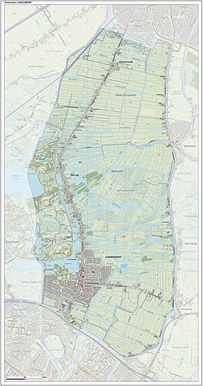

# `Hello, World!`

This is part of a series of posts/repositories in which I explore the use of different tools relevant for my work as social-environmental impact research, ranging from visualizations to predictive modeling using \#TidyTuesday or other open datasets.

## What is this about?

Here, I used [`OpenStreetMap`](https://github.com/ropensci/osmdata) R package to make a poster-like visualization of Landsmeer, The Netherlands. I moved to Landsmeer from Amsterdam last October, 2020.

Landsmeer is a former chicken-egg production town full of waterways, situated just south of a natural par, Twiske. It is thus an interesting landscape of different land cover features to visualize.

## What are my references?

A tutorial by [Josh McGrain](http://joshuamccrain.com/) was useful to guide the exploration of the OpenStreetMap R Package. You can access it [here](http://joshuamccrain.com/tutorials/maps/streets_tutorial.html).

Happy mapping :unicorn:!
